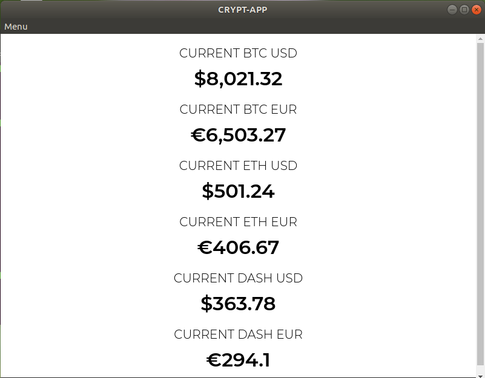

# crypto-app

# Screenshot

Displays the current value of Crypto-Currencies like Bitcoin, Dash and  Rutheneum.

# Initial Requirements
Elctron requires Node.js 4.0 or higher to run.

# Installation
## for use in npm scripts 
npm install electron-packager --save-dev
 
## for use from cli 
npm install electron-packager -g

# To run
On command terminal : electron .
